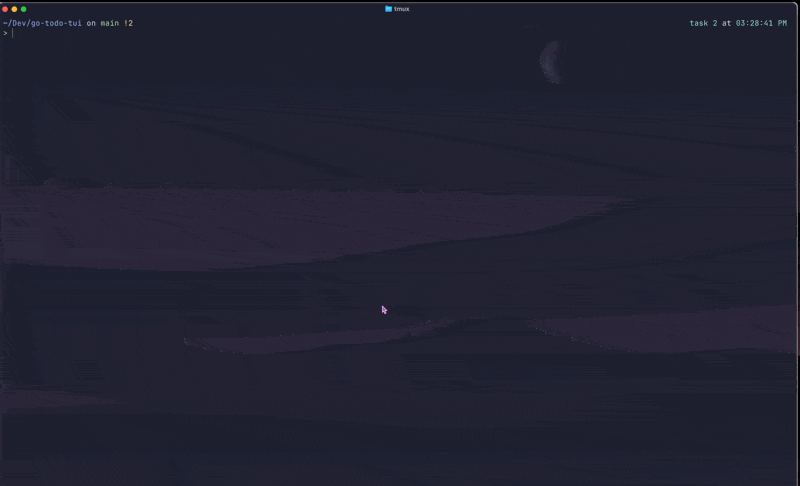

# Todo TUI app built with Go

A beautiful, project-aware terminal user interface (TUI) for managing todo lists, inspired by lazygit's interface design.

## Features

- 🎨 Beautiful TUI - Clean, modern interface with colors and smooth interactions
- 📁 Project-aware - Automatically creates `.todos.db` in current directory for project-specific todos
- 🌐 Global todos - Access global todo list from anywhere with `-g` flag
- 🗄️ SQLite storage - Reliable database storage with automatic table creation
- ⚡ Fast navigation - Vim-like keybindings (j/k or arrow keys)
- 🎯 Zero dependencies - Single binary with no external requirements



## Prerequisites

Go 1.21 or higher
CGO support (for SQLite)

## Install from source

```sh
git clone https://github.com/dilloncaldwell/go-todo-tui.git
go mod tidy
go build -o todo .
./todo
```

## Install globally

```sh
# Install to $GOPATH/bin
go install .

# Make sure ~/go/bin is in your PATH use .zshrc or .bashrc
echo 'export PATH=$PATH:~/go/bin' >> ~/.zshrc
source ~/.zshrc

# or i like to do, so i can keep ~/.config/zsh
echo 'export GOPATH="$XDG_DATA_HOME/go"' >> ~/.zshenv
echo 'export GOBIN="$GOPATH/bin"' >> ~/.zshenv
echo 'export PATH="/opt/homebrew/opt/go/bin:$PATH"' >> ~/.zshenv
echo 'export PATH="$GOBIN:$PATH"' >> ~/.zshenv

```

## Usage

### Basic Commands

```sh
# Create/open todos in current directory
todo

# Access global todos from anywhere
# (uses XDG_DATA_HOME or .local/share to store .todos.db)
todo -g

# Use custom database path
todo --config ~/work/todos.db
```

→/l/pgdn
←/h/pgup

### TUI Controls

| key             | action                     |
| --------------- | -------------------------- |
| `↑/↓` or `j/k`  | Navigate tasks             |
| `←/→` or `h/l`  | Navigate pages of tasks    |
| `gg`            | Jump to top of list        |
| `G`             | Jump to bottom of list     |
| `a`             | Add task                   |
| `e`             | edit task                  |
| `d`             | Delete task                |
| `f`             | Filter task views          |
| `s`             | Sort tasks (by id or date) |
| `t` or `space`  | Toggle task completion     |
| `q` or `Ctrl+c` | Quit                       |
| `enter`         | Confirm action             |
| `esc`           | Cancel action              |

## Database Locations

- Local: `.todos.db` in current working directory
- Global: `$XDG_DATA_HOME/todos.db` or `~/.local/share/todos.db`
- Custom: Any path specified with `--config`

## Tmux Integration

Add this to your tmux config for quick access:

```sh
# Basic popup
bind C-t display-popup \
  -d "#{pane_current_path}" \
  -w 80% \
  -h 80% \
  "todo -g"

# Smart popup (local todos if .todos.db exists, otherwise global)
bind C-t display-popup \
  -d "#{pane_current_path}" \
  -w 80% \
  -h 80% \
  "if [ -f .todos.db ]; then todo; else todo -g; fi"
```

Then press prefix (`ctrl+b`) then `Ctrl+t` from anywhere in tmux to open your todos in a popup.

## Dependencies

- Bubble Tea - TUI framework
- Bubbles - Common TUI components
- Lipgloss - Styling and layout
- go-sqlite3 - SQLite driver
